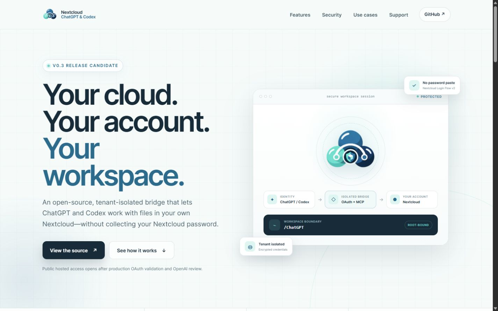

# Nextcloud for ChatGPT & Codex


An open-source, tenant-isolated bridge that lets ChatGPT and Codex work with files in a
user-owned Nextcloud workspace. The bridge keeps its OAuth identity separate from Nextcloud
credentials and uses standards-based providers when native Nextcloud MCP capabilities are absent.

Product website: [nextcloud-for-chatgpt.v4t0r.chatgpt.site](https://nextcloud-for-chatgpt.v4t0r.chatgpt.site)



## Release status

`v0.3.0` is the public-app and production-deployment release candidate.

The repository contains the application-side pieces required for a universal OAuth-protected MCP
service:

- request-scoped bridge identity and pseudonymous tenant isolation
- Nextcloud Login Flow v2 without collecting a user's Nextcloud password
- tenant-scoped metadata plus encrypted PostgreSQL credential storage
- root-bound WebDAV and OCS providers with explicit read/write tools
- conservative household invoice review that never approves, books, pays, or transmits
- rate limiting, request limits, security headers, trusted-host checks, and stateless MCP transport
- a DNS-rebinding-resistant HTTPS egress proxy and network-isolated production composition
- database migrations, readiness checks, maintenance cleanup, and release preflight
- a Codex plugin package plus reviewer-ready OpenAI listing and test material
- a production landing site with privacy, terms, support, and security pages

The source release does **not** claim an active public service or OpenAI approval. Public availability
still requires an operator-controlled production domain, external OAuth configuration, reviewer
fixture, verified publisher identity, and successful OpenAI review.

The MCP bridge itself works without directory publication. Codex CLI, ChatGPT desktop, and the
Codex IDE extension can connect directly; compatible remote MCP hosts can use a deployed HTTPS
endpoint. ChatGPT web requires developer-mode access for an unpublished connection or installation
of a published plugin. See [deployment modes](docs/DEPLOYMENT_MODES.md).

## Real Nextcloud validation

The standards-based fallback path passed a live integration run against Nextcloud `33.0.7`:

- authenticated OCS discovery
- WebDAV listing, create, upload, download, metadata lookup, move, and cleanup
- user-visible app inventory and root-bound share inventory
- isolated synthetic household workspace and invoice-review flow

Native Nextcloud Context Agent MCP was unavailable on that instance. The successful fallback run is
therefore direct evidence that native MCP is optional rather than a hidden dependency. No credentials
or instance-identifying values are recorded. See [the compatibility matrix](docs/COMPATIBILITY.md).

## Architecture

```text
ChatGPT / Codex
       |
       | OAuth access token
       v
Public stateless MCP boundary
       |
       | verified issuer + subject + scopes
       v
BridgeSessionContext
       |
       | pseudonymous tenant scope
       v
ConnectionService
       |-- PostgreSQL connection metadata
       `-- AES-256-GCM credential store
       |
       | Nextcloud Login Flow v2 credential
       v
Root-bound provider core
       |-- WebDAV files
       |-- OCS capabilities, apps, shares, revocation
       `-- Native Nextcloud MCP discovery when available
```

The bridge identity never contains a Nextcloud username or credential. Every connection, pending
flow, household profile, and credential operation is scoped by the verified tenant context.

## Public MCP tools

**Read and discovery**

- `get_nextcloud_capabilities`
- `get_nextcloud_app_accesses`
- `probe_native_nextcloud_mcp`
- `list_files`, `search_files`, `list_nextcloud_shares`
- `get_file_info`, `read_text_file`, `download_file_base64`
- `list_nextcloud_connections`, `list_household_accounts`, `list_household_invoices`
- `review_household_invoice`

**Create or modify private Nextcloud state**

- `write_text_file`, `upload_file_base64`, `create_folder`, `move_file`, `delete_file`
- `begin_nextcloud_connection`, `poll_nextcloud_connection`, `set_nextcloud_root`
- `disconnect_nextcloud`
- `configure_household_account`, `prepare_household_workspace`
- `save_household_invoice_review`

Every hosted tool has an explicit title, description, input schema, output schema, and risk
annotations. The production tool contract is locked by automated tests and documented in
[`submission/TOOL_ANNOTATIONS.md`](submission/TOOL_ANNOTATIONS.md).

## Security defaults

- account root `/` and parent traversal are rejected before provider access
- every returned WebDAV path is rechecked against the configured root
- HTTPS and TLS verification are mandatory for hosted Nextcloud targets
- public targets are resolved, validated, and IP-pinned by a CONNECT-only egress proxy
- bearer tokens, app passwords, share tokens, raw invoice text, and full IBANs are excluded from
  model-visible results
- credential ciphertext is tenant-bound through AES-GCM authenticated data
- overwrite is opt-in; the configured root cannot be deleted
- request body and transfer sizes are bounded
- write, overwrite, move, delete, disconnect, and credential-revocation risks are explicit
- hosted access is stateless and derives a fresh identity for every MCP request

Read [`SECURITY.md`](SECURITY.md) before deployment. Report vulnerabilities through
[GitHub private vulnerability reporting](https://github.com/v4t0r/nextcloud-chatgpt-bridge/security/advisories/new),
never through a public issue containing secrets or private data.

## Local development

Requires Python 3.11 or newer.

```bash
python -m venv .venv
source .venv/bin/activate  # Windows: .venv\Scripts\activate
pip install -e ".[dev,hosted]"
ruff check .
pytest
```

Copy `.env.example` to `.env` only for local testing. Use a dedicated Nextcloud account and app
password, keep the root narrow, and never commit the resulting file.

Run the local stdio server:

```bash
nextcloud-chatgpt-bridge
```

Run sanitized read-only diagnostics or the explicit temporary write/cleanup smoke test:

```bash
nextcloud-chatgpt-diagnose
nextcloud-chatgpt-diagnose --write-test
```

## Production deployment

The reference composition is in [`deploy/compose.production.yml`](deploy/compose.production.yml).
It separates PostgreSQL, the bridge, maintenance, egress, and TLS termination, and keeps the bridge
off the direct external network.

```bash
cp deploy/.env.production.example deploy/.env.production
docker compose --env-file deploy/.env.production \
  -f deploy/compose.production.yml config
docker compose --env-file deploy/.env.production \
  -f deploy/compose.production.yml up -d
```

Supply database and encryption secrets as files outside Git. Apply migrations through the dedicated
`migrate` service, then run `nextcloud-chatgpt-preflight` against the exact public MCP, OAuth,
website, support, privacy, and terms URLs before any reviewer access.

See [`docs/PRODUCTION_DEPLOYMENT.md`](docs/PRODUCTION_DEPLOYMENT.md) and
[`docs/HOSTED_ACCEPTANCE.md`](docs/HOSTED_ACCEPTANCE.md).

## OpenAI submission package

Repository-side review material lives in [`submission/`](submission/):

- canonical listing copy and starter prompts
- positive and negative reviewer cases
- reviewer fixture and runbook
- exact tool-annotation inventory
- release notes and final operational checklist

The final OpenAI submission remains an owner-controlled action. See
[`docs/PLUGIN_SUBMISSION.md`](docs/PLUGIN_SUBMISSION.md).

## Project documents

- [Authentication and credential boundaries](docs/AUTH_ARCHITECTURE.md)
- [Private, hosted, and no-store deployment modes](docs/DEPLOYMENT_MODES.md)
- [MCP tools and provider behavior](docs/MCP.md)
- [Household and invoice boundary](docs/HOUSEHOLD_ARCHITECTURE.md)
- [Privacy model](docs/PRIVACY.md)
- [Terms and service boundary](docs/TERMS.md)
- [Release process](docs/RELEASE.md)
- [Roadmap](docs/ROADMAP.md)

## License

Licensed under the [Apache License 2.0](LICENSE). This independent project is not affiliated with or
endorsed by Nextcloud GmbH or OpenAI.
